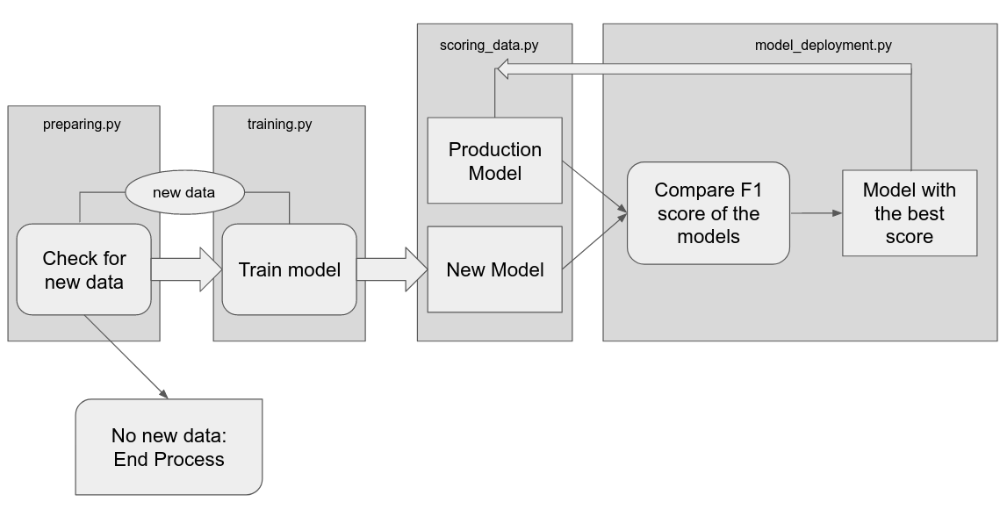
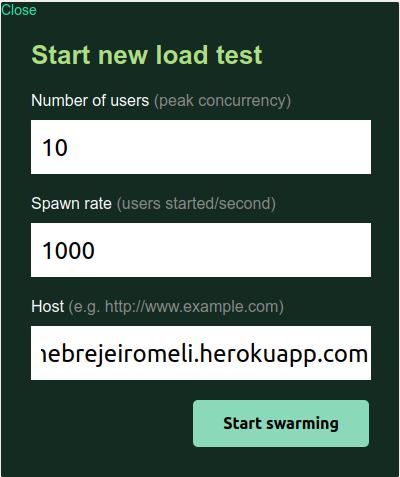
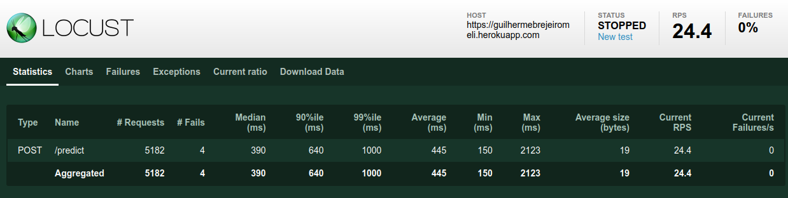

# Machine Learning Engineer Evaluation Exam

## Summary

For this challenge I used a Platform as a Service (PaaS) known as Heroku, simulating an environment that receives data into buckets and trains the model with it, if it's performance is better to the performance of the previously trained model, this becomes the model in production, otherwise the previous model remains as the productive model.
P.S. To focus on design and implementation, the dataset and the ML training chosen was as simple as possible
## Achievements
1. Choose a simple database, split it into small slots to simulate the real enviroment that receives new data and retrains the model
2. Develop functions to:
    * Appending new data and retrain the model (preparing.py)
    * Using StandardScaler to preprocessing data and train the model on AdaBoostClassifier (training.py)
    * Scoring model on test data and save f1 score on a .txt file (scoring_data.py)
    * Send the model to production environment (model_deployment.py)
3. Develop an API to get the features and return the prediction from the best scoring model (main.py on heroku)
4. Load testing the API using locust (load_test.py)
5. Create a bitbucket pipeline to automate the process of install dependences, test modules and push to heroku at every commit

## Folders

* data 
    - all_data: gathers all databases that are inputed in the process
    - final_data: all data joined in one big dataset, excluding any duplicate
    - test_data: a small dataset split from the original data, used for test model's predictions
* model
    - last_model: the last model trained, last encoder trained and it's scores on test data
    - production_model: the best model trained, it's encoder and it's scores on test data
* modules
    - ml_support_modules: auxiliar functions used for read, clean and select models
    - preparing.py: take all data available in "all_data", merge it, drop duplicates and save it on "final_data"
    - training.py: train the model using "final_data" content and save model, encoder and logs on "last_model"
    - scoring_data.py: take the model from "last_model" and score it's predictions
    - model_deployment.py: compare the model from 'last_model" with the model from "production_model" the best one become the production model
    - full_cicle.py: run the complete pipeline with all the previously functions
    - main.py: FastAPI definitions and model specifications necessary to run the API
    - config.json: paths to directories
    - load_test.py: run locust with POST request to the API and test the load (rps)
* mlops
    - bitbucket-pipelines.yml: CI/CD installing the requirements, run the tests and automaticaly push the updates to Heroku
    - Procfile: declares the commands to run the API
    - requirements: all the dependences necessary to run the app
    - wine_notebooks.ipynb: a simple EDA to understand the data before starting my project

## ML in the cloud
### AWS
For this project I didn't use any of the most common clouds to avoid costs and to focus on tools like Heroku, FastAPI and Bitbucket but all of it can be integrated with cloud providers.
An example would be the mlops pipeline on AWS:
- Some code repository like GitLab, Github or even Bitbucket could be use to create the pipelines of CI/CD
- SageMaker Pipelines to create data preparation, model training and model evaluation
- Amazon S3 to store data on it's buckets
- AWS Lambda to triggers functions for the model deployment after a new model get register and has a better score
- SageMaker Model Registry to track model versions and artifacts
- AWS CloudFormation to deploy and create the SageMaker endpoints when the trigger approuves the model score
- SageMaker hosting to creates HTTPS real-time endpoints

### GCP
An example for GCP mlops pipelines would be:

- GCP AI Platform to create the pipelines, jobs dependencies and run it 
- GCP AI Platform to train the model 
- GCP AI Platform for making predictions with a unified end point and model version control
- GCP Cloud Storage to store data on it's buckets
- GCP Cloud Functions to set the logical triggers based on events, listening data changes in Cloud Storage and trigger the running pipeline with it
- GCP Cloud Build for unit test and deploy services integrated with code

## API service handle 1000+ RPM
To make load tests on the API, it was used a python package called locust (load_test.py)
After run this function it creates an online link to select how many requests per minute I want to send to my API

Here I specify 10 users sending 1000 requests

The locust just return requests for seconds but converting itś possible to see that the API could receive 1000+ requests per minute (16.7 requests per second)

### Some points on solution proposed
* For autenthication it was used SSH and API key from heroku and bitbucket, on the cloud you can use services as IAM (for AWS) or Cloud IAM (for GCP).
* For error handling it's possible to use test functions using expected values output and 200 code from API post, I use some simple test functions with pytest.
* From API service error you can change DYNO file from heroku or user k8s services on cloud to load balance the application.
* To log data it's possible to use tools like DVC (Data Version Control) with bucket services to keep tracking all ML models and data sets, I create some simple functions to log the names on a .txt file.
* At least for now I can write code on Python and PySpark, with some small knowledge about Scala

With more time and resources I would use Cloud, k8s, MLFlow, DVC, prometheus and kibana. Depending on the kind of ML model Tensorflow and TFX would be great.
